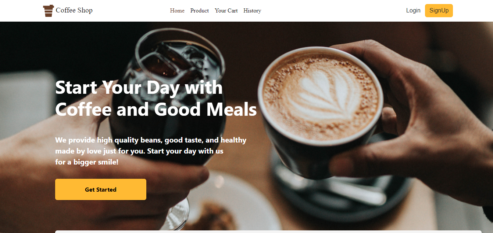
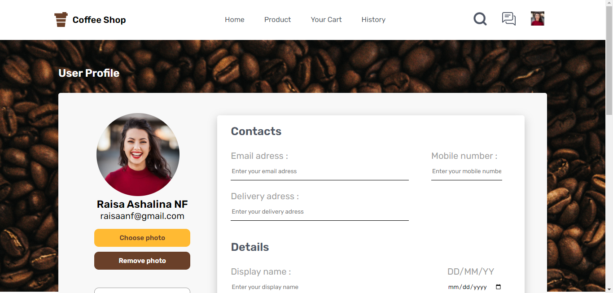
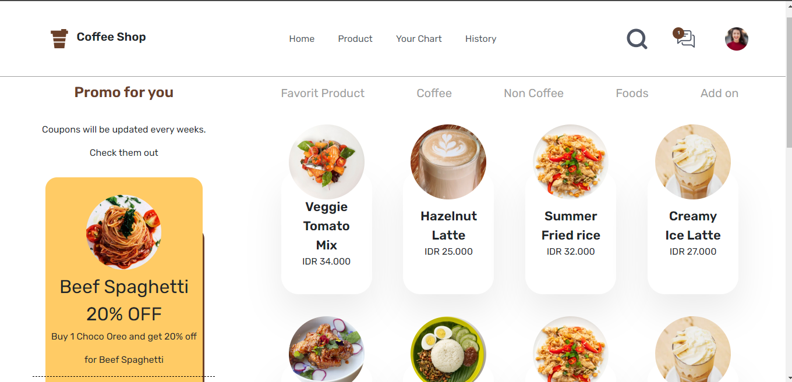
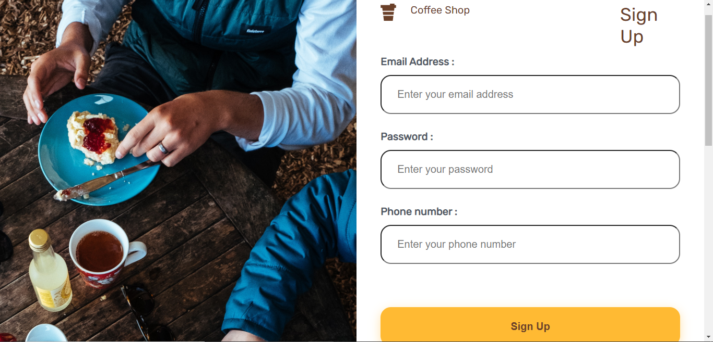
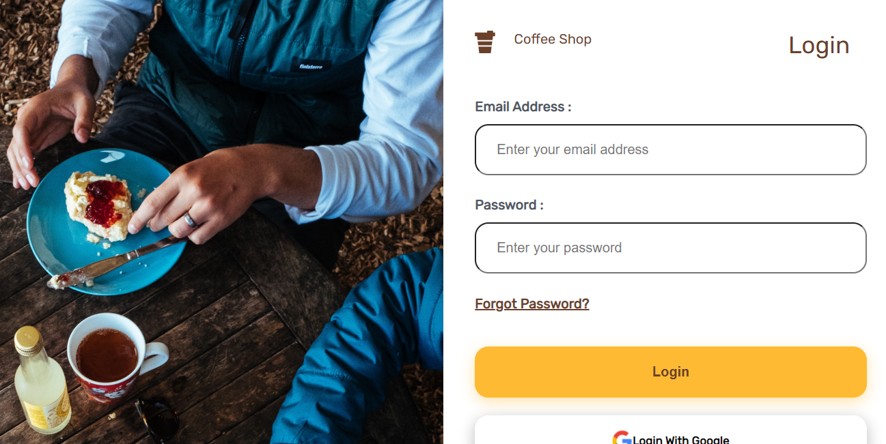

<h1 style="text-align: center">Coffee Shop</h1>

<div style="display: flex; justify-content:center;">
</img>
</div>


# How To Install

1. Clone The Repository
```
  $ git clone https://github.com/IrfanAlfiansyah/cafebrick-client-html.git
```
2. Open [VS Code](https://code.visualstudio.com/)
3. Install [Live Server Extention For VS Code](https://marketplace.visualstudio.com/items?itemName=ritwickdey.LiveServer)
4. Right Click _index.html_ then choose **Open With Live Server**

## Preview
</img>
</img>
</img>
</img>
</img>


## Related Project

[Link ke Backend]()